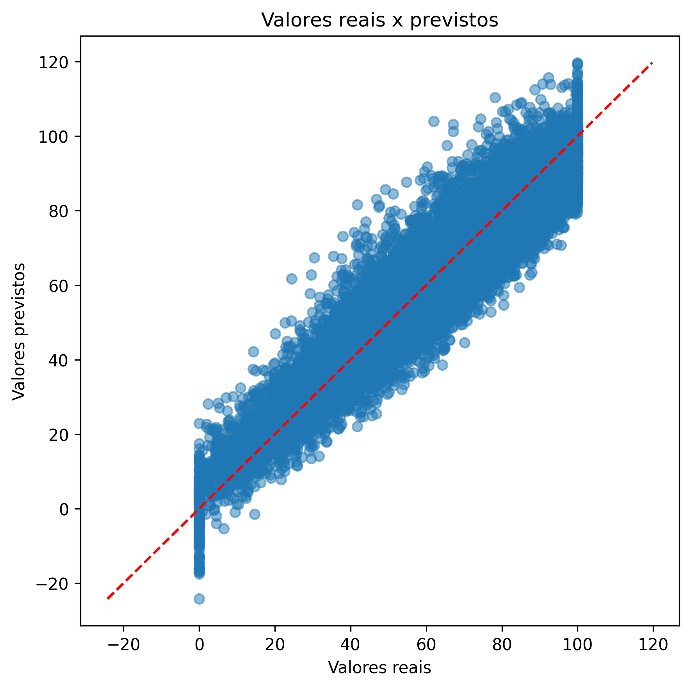
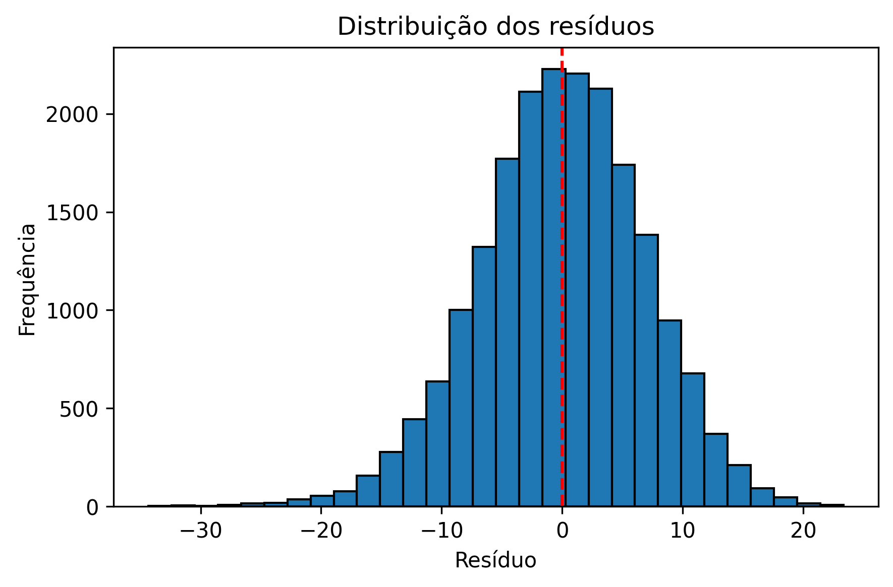

# Predição de Desempenho Cognitivo a partir de Dados de Sono e Saúde

Projeto desenvolvido para prever o desempenho cognitivo de uma pessoa no dia seguinte a partir de informações relacionadas ao sono, hábitos de vida, indicadores fisiológicos e fatores comportamentais.

Este projeto implementa um pipeline completo de Machine Learning para previsão de desempenho cognitivo utilizando técnicas de preparação de dados, engenharia de atributos, regressão linear e avaliação de modelos.

O desenvolvimento foi realizado como projeto avaliativo da disciplina Desenvolvimento de IA para Análise Preditiva (módulo 1).

## Problema preditivo

O objetivo é estimar a variável `cognitive_performance_score`, uma pontuação de desempenho cognitivo na escala de 0 a 100. A solução utiliza o modelo de regressão linear e pode apoiar análises sobre como sono, estresse e estilo de vida se relacionam com o desempenho cognitivo.

O modelo deve ser utilizado como ferramenta de apoio analítico e não como substituto de uma avaliação clínica.

## Dataset

Foi utilizado o dataset **Sleep Health and Daily Performance Dataset**, disponível no **Kaggle**.

**Fonte:** [Sleep Health and Daily Performance Dataset](https://www.kaggle.com/datasets/mohankrishnathalla/sleep-health-and-daily-performance-dataset)

O conjunto de dados sintéticos contém **100.000 registros** e **32 variáveis**, reunindo informações sobre sono, hábitos de vida, indicadores fisiológicos e desempenho cognitivo, bem como:

- duração e qualidade do sono;
- percentual de sono REM e sono profundo;
- nível de estresse e jornada de trabalho;
- consumo de cafeína e álcool;
- prática de exercícios e quantidade de passos;
- frequência cardíaca em repouso;
- indicadores de saúde mental e risco de distúrbios do sono.

A coluna `person_id` foi removida por ser apenas um identificador e não contribuir para a previsão.

## Etapas da solução

1. Análise exploratória e estatística descritiva.
2. Verificação de registros duplicados e valores ausentes.
3. Análise de outliers e correlação de Pearson.
4. Verificação de multicolinearidade por meio do VIF.
5. Criação da variável `recovery_score`, calculada pela diferença entre qualidade do sono e estresse.
6. Remoção de `sleep_quality_score` e `stress_score` após a criação da nova variável(`recovery_score`), evitando multicolinearidade perfeita.
7. Divisão dos dados em 80% para treino e 20% para teste.
8. Pré-processamento e treinamento do modelo em uma Pipeline.
9. Avaliação, diagnóstico de overfitting e versionamento do modelo.

## Técnicas utilizadas

- Regressão Linear;
- One-Hot Encoding para variáveis categóricas;
- Padronização das variáveis numéricas com `StandardScaler`;
- Pipeline e `ColumnTransformer`;
- Separação treino/teste com semente fixa (`random_state=42`);
- Análise de correlação e Variance Inflation Factor (VIF);
- Análise de resíduos e comparação entre valores reais e previstos;
- Avaliação com MAE, MSE, RMSE e R²;
- Serialização e versionamento do modelo com Joblib.

O pré-processamento faz parte da mesma Pipeline do modelo. Assim, os parâmetros são ajustados somente nos dados de treino, reduzindo o risco de vazamento de dados.

## Tecnologias

- Python
- Jupyter Notebook
- Pandas e NumPy
- Scikit-learn
- Matplotlib e Seaborn
- Statsmodels
- Joblib
- Git
- GitHub

## Resultados da versão v1

Após a validação, o modelo foi retreinado utilizando toda a base de dados para geração da versão v1 salva na pasta models/.

| Métrica | Resultado |
| --- | ---: |
| MAE | 6,0173 |
| MSE | 58,6167 |
| RMSE | 7,6562 |
| R² | 0,8807 |

O MAE indica um erro médio de aproximadamente 6 pontos na escala de desempenho cognitivo. O R² indica que o modelo explica cerca de 88,07% da variabilidade observada na variável-alvo. A comparação entre treino e teste apresentou resultados próximos, sem evidências relevantes de overfitting.

Arquivos da versão:

- modelo: [`models/v1/modelo_regressao_v1.pkl`](models/v1/modelo_regressao_v1.pkl);
- métricas e variáveis explicativas: [`models/v1/metricas_v1.json`](models/v1/metricas_v1.json).

## Visualizações

### Valores reais e previstos

Os pontos próximos da linha de referência indicam que, na maior parte dos casos, as previsões ficaram próximas dos valores reais.



### Distribuição dos resíduos

Os resíduos estão concentrados próximos de zero e apresentam uma distribuição aproximadamente normal.



Outras visualizações da análise exploratória estão disponíveis em [`outputs/figures`](outputs/figures).

## Estrutura do projeto

```text
SCTEC-PROJETO-MD1/
├── data/
│   ├── raw/              # Dataset original
│   ├── processed/        # Dataset após tratamento e feature engineering
│   └── final/            # Dataset final utilizado na modelagem
├── models/
│   └── v1/               # Modelo e métricas da versão entregue
├── notebooks/
│   └── dataview.ipynb    # Análise completa e execução do projeto
├── outputs/
│   └── figures/          # Gráficos gerados durante a análise
├── src/
│   ├── __init__.py
│   ├── config.py         # Caminhos e configurações
│   ├── dataset.py        # Leitura e gravação dos datasets
│   ├── eda.py            # Análise exploratória
│   ├── preprocessing.py  # Tratamento e preparação dos dados
│   ├── modeling.py       # Treinamento, avaliação e versionamento
│   └── utils.py          # Funções auxiliares
├── requirements.txt
└── README.md
└── LICENSE
```

## Como executar

### 1. Clone o repositório

```bash
git clone https://github.com/Jenifer19IFC/SCTEC-Projeto-MD1.git
cd SCTEC-PROJETO-MD1
```

### 2. Crie e ative um ambiente virtual

```bash
python3 -m venv .venv
source .venv/bin/activate
```

No Windows, use:

```bash
.venv\Scripts\activate
```

### 3. Instale as dependências

```bash
pip install -r requirements.txt
```

### 4. Execute o notebook

```bash
jupyter notebook notebooks/dataview.ipynb
```

Execute as células na ordem para reproduzir a análise, o tratamento dos dados, o treinamento e a avaliação.

## Possíveis melhorias

Para versões futuras, podem ser considerados:

- validação cruzada para obter uma estimativa mais robusta do desempenho;
- exploração de Feature Engineering na tentativa de alcançar um melhor desempenho;
- comparar com outro modelo, como o KNN.

## Observação

Este projeto possui finalidade educacional. Como o dataset é sintético, os resultados não devem ser interpretados como evidência clínica nem generalizados diretamente para cenários reais.

## Demonstração

[▶️ Assistir à apresentação do projeto](https://youtu.be/SEU_LINK)